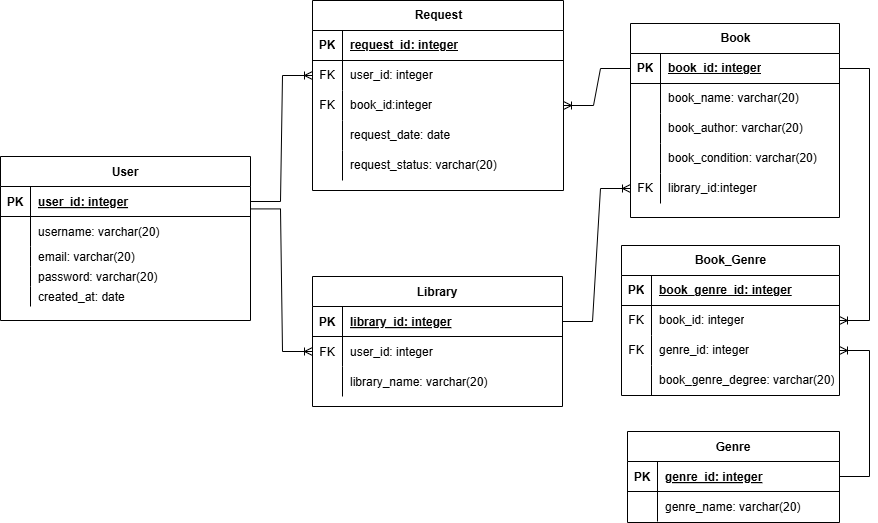

# Модели

## ERD



## `models.py`
```python
from enum import Enum
from datetime import datetime
from typing import Optional, List

from pydantic import validator, EmailStr
from sqlmodel import SQLModel, Field, Relationship


class ConditionType(str, Enum):
    excellent = "excellent"
    good = "good"
    used = "used"

class RequestStatusType(Enum):
    waiting = "waiting"
    approved = "approved"
    rejected = "rejected"

class DegreeType(Enum):
    low = "low"
    medium = "medium"
    high = "high"


class RequestDefault(SQLModel):
    user_id: Optional[int] = Field(default=None, foreign_key="user.user_id")
    book_id: Optional[int] = Field(default=None, foreign_key="book.book_id")

class RequestStatus(RequestDefault):
    request_status: RequestStatusType = "waiting"

class Request(RequestStatus, table=True):
    request_id: Optional[int] = Field(default=None, primary_key=True)
    request_date: datetime = datetime.now()


class UserInput(SQLModel):
    username: str
    password: str = Field(max_length=256, min_length=6)
    password2: str
    email: EmailStr

    @validator('password2')
    def password_match(cls, v, values, **kwargs):
        if 'password' in values and v != values['password']:
            raise ValueError('passwords do not match')
        return v
    
class UserDefault(SQLModel):
    username: str = Field(index=True)
    email: EmailStr

class UserPassword(UserDefault):
    password: str = Field(max_length=256, min_length=6)

class User(UserPassword, table=True):
    user_id: Optional[int] = Field(default=None, primary_key=True)
    created_at: datetime = datetime.now()
    libraries: Optional[List["Library"]] = Relationship(back_populates="user", cascade_delete=True)
    books: Optional[List["Book"]] = Relationship(back_populates="users", link_model=Request)

class UserLogin(SQLModel):
    username: str
    password: str

class UserOutput(UserDefault):
    libraries: Optional[List["LibraryOutput"]] = None


class LibraryInput(SQLModel):
    library_name: str

class LibraryDefault(SQLModel):
    library_name: str
    user_id: Optional[int] = Field(default=None, foreign_key="user.user_id", ondelete="CASCADE")

class Library(LibraryDefault, table=True):
    library_id: Optional[int] = Field(default=None, primary_key=True)
    user: User = Relationship(back_populates="libraries")
    books: Optional[List["Book"]] = Relationship(back_populates="library", cascade_delete=True) 

class LibraryOutput(LibraryDefault):
    library_id: int
    user_id: int
    books: Optional[List["Book"]] = None


class BookGenreLinkDefault(SQLModel):
    genre_id: Optional[int] = Field(default=None, foreign_key="genre.genre_id")
    book_id: Optional[int] = Field(default=None, foreign_key="book.book_id")
    book_genre_degree: DegreeType

class BookGenreLink(BookGenreLinkDefault, table=True):
    book_genre_id: Optional[int] = Field(default=None, primary_key=True)


class GenreDefault(SQLModel):
    genre_name: str

class Genre(GenreDefault, table=True):
    genre_id: Optional[int] = Field(default=None, primary_key=True)
    books: Optional[List["Book"]] = Relationship(back_populates="genres", link_model=BookGenreLink)

class GenreBooks(GenreDefault):
    genre_id: int
    books: Optional[List["Book"]] = None


class BookDefault(SQLModel):
    book_name: str
    book_author: str
    book_condition: ConditionType
    library_id: Optional[int] = Field(default=None, foreign_key="library.library_id", ondelete="CASCADE")

class Book(BookDefault, table=True):
    book_id: Optional[int] = Field(default=None, primary_key=True)
    library: Library = Relationship(back_populates="books")
    users: Optional[List[User]] = Relationship(back_populates="books", link_model=Request)
    genres: Optional[List[Genre]] = Relationship(back_populates="books", link_model=BookGenreLink)

class BookLibraries(BookDefault):
    book_id: int
    library: LibraryOutput
    users: Optional[List[User]] = None
    genres: Optional[List[Genre]] = None
```