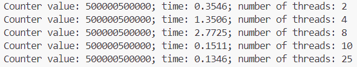
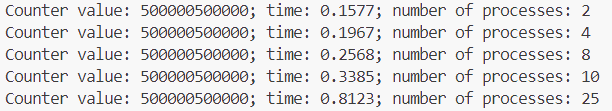
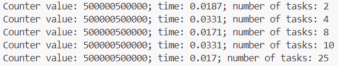

# Задача 1. Различия между threading, multiprocessing и async в Python

Напишите три различных программы на Python, использующие каждый из подходов: threading, multiprocessing и async. Каждая программа должна считать сумму всех чисел от 1 до 1000000. Разделите вычисления на несколько параллельных задач для ускорения выполнения.

## Порядок выполнения:

1. Напишите программу на Python для каждого подхода: threading, multiprocessing и async.

2. Каждая программа должна содержать функцию calculate_sum(), которая будет выполнять вычисления.

3. Для threading используйте модуль threading, для multiprocessing - модуль multiprocessing, а для async - ключевые слова async/await и модуль asyncio.

4. Каждая программа должна разбить задачу на несколько подзадач и выполнять их параллельно.

5. Замерьте время выполнения каждой программы и сравните результаты.

## threading

```python
import threading
import time

counter = 0
lock = threading.Lock()

def calculate_sum(beg, end):
    global counter
    for i in range(beg, end):
        lock.acquire()
        counter += i
        lock.release()


def main(num):
    global counter
    threads = []
    beg = 1
    step = int(1000000 / num)
    for i in range(num):
        end = beg + step
        threads.append(threading.Thread(target=calculate_sum, args=(beg, end, )))
        beg = end
    start = time.time()
    for thread in threads:
        thread.start()
    for thread in threads:
        thread.join()
    finish = time.time() - start
    print(f'Counter value: {counter}; time: {round(finish, 4)}; number of threads: {num}')
    counter = 0


if __name__ == '__main__':
    thread_nums = [2, 4, 8, 10, 25]
    for thr in thread_nums:
      main(thr)
```

**Результаты:**



## multiprocessing

Для межпроцессного обмена данными использую очереди, так как этот вид обмена более безопасный.

```python
from multiprocessing import Process, Queue
import time


def calculate_sum(beg, end, q):
    counter = 0
    for i in range(beg, end):
        counter += i
    q.put(counter)


def main(num):
    q = Queue()
    processes = []
    beg = 1
    step = int(1000000 / num)
    for i in range(num):
        end = beg + step
        processes.append(Process(target=calculate_sum, args=(beg, end, q,)))
        beg = end
    start = time.time()
    for p in processes:
        p.start()
    for p in processes:
        p.join()
    finish = time.time() - start
    answer = 0
    while not q.empty():
        answer += q.get()
    print(f'Counter value: {answer}; time: {round(finish, 4)}; number of processes: {num}')

if __name__ == '__main__':
    process_nums = [2, 4, 8, 10, 25]
    for process_num in process_nums:
      main(process_num)
```

**Результаты:**



## async

```python
import asyncio
import time


async def calculate_sum(beg, end):
    counter = 0
    for i in range(beg, end):
        counter += i
    return counter


async def main(num):
    beg = 1
    step = int(1000000 / num)
    calculate_tasks = []
    start = time.time()
    for i in range(num):
        end = beg + step
        beg_new = beg
        beg = end
        calculate_task = asyncio.create_task(calculate_sum(beg_new, end))
        calculate_tasks.append(calculate_task)
    answers = await asyncio.gather(*calculate_tasks)
    finish = time.time() - start
    print(f'Counter value: {sum(answers)}; time: {round(finish, 4)}; number of tasks: {num}')

if __name__ == '__main__':
    task_nums = [2, 4, 8, 10, 25]
    for task_num in task_nums:
        asyncio.run(main(task_num))
```

**Результаты:**



## Выводы

 - Multiprocessing показывает лучшие результаты, чем threading при 2-8 потоках/процессах, т.к. задача связана с вычислениями. Глобальная блокировка интерпретатора не позволяет одновременно выполняться нескольким потокам. 

 - Увеличение количества процессов приводит к замедлению выполнения программы. Это может быть связано с более высокой сложностью создания процесса (в отличие от потока) и невысокой сложностью самой задачи.

 - Применение асинхронности показало лучшие результаты по времени, однако разбиение задачи на все большее количество подзадач не приводит к более быстрому выполнению задачи. Это может быть связано с особенностью задачи (узкое место в скорости процессора, а не в ожидании ответа).