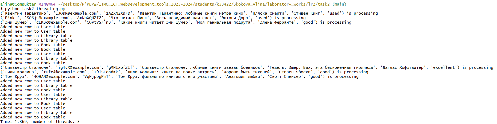
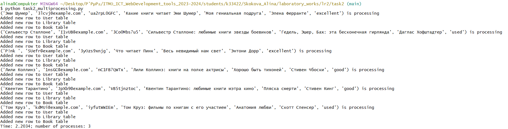
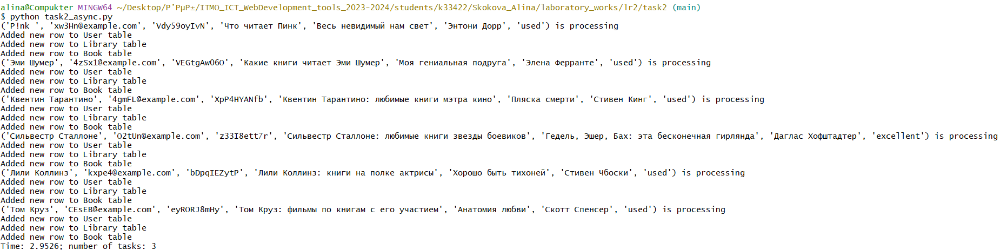

# Задача 2. Параллельный парсинг веб-страниц с сохранением в базу данных

Напишите программу на Python для параллельного парсинга нескольких веб-страниц с сохранением данных в базу данных с использованием подходов threading, multiprocessing и async. Каждая программа должна парсить информацию с нескольких веб-сайтов, сохранять их в базу данных.

## Порядок выполнения:

1. Напишите три различных программы на Python, использующие каждый из подходов: threading, multiprocessing и async.

2. Каждая программа должна содержать функцию parse_and_save(url), которая будет загружать HTML-страницу по указанному URL, парсить ее, сохранять заголовок страницы в базу данных и выводить результат на экран.

3. Используйте базу данных из лабораторной работы номер 1 для заполенния ее данными.

4. Для threading используйте модуль threading, для multiprocessing - модуль multiprocessing, а для async - ключевые слова async/await и модуль aiohttp для асинхронных запросов.

5. Создайте список нескольких URL-адресов веб-страниц для парсинга и разделите его на равные части для параллельного парсинга.

6. Запустите параллельный парсинг для каждой программы и сохраните данные в базу данных.

7. Замерьте время выполнения каждой программы и сравните результаты.

## Подключение к серверу PostgreSQL

Сначала был создан конфигурационный файл `database.ini` по шаблону:

```
[postgresql]
host=localhost
database=DatabaseName
user=YourUsername
password=YourPassword
```

Затем был создан файл `config.py` с функцией `load_config()`, которая читает данные конфигурации из `database.ini`:

```python
from configparser import ConfigParser

def load_config(filename='database.ini', section='postgresql'):
    parser = ConfigParser()
    parser.read(filename)

    # get section, default to postgresql
    config = {}
    if parser.has_section(section):
        params = parser.items(section)
        for param in params:
            config[param[0]] = param[1]
    else:
        raise Exception('Section {0} not found in the {1} file'.format(section, filename))

    return config

if __name__ == '__main__':
    config = load_config()
    print(config)
```

Используя `database.ini`, можно скрывать информацию о доступе в БД, убирая ее из публичного доступа.

## Добавление записей в БД

```python
import psycopg2
from config import load_config
import bcrypt
from datetime import datetime

def hash_password(password):
    pwd_bytes = password.encode('utf-8')
    salt = bcrypt.gensalt()
    hashed_pwd = bcrypt.hashpw(password=pwd_bytes, salt=salt)
    return hashed_pwd.decode('utf-8')

def insert_data(new_data):
    config = load_config()
    for entry in new_data:
        print(f'{entry} is processing')
        new_username, new_email, new_password, new_library_name, new_book_name, new_book_author, new_book_condition = entry
        pass_hashed = hash_password(new_password)
        sql_user = f"""INSERT INTO public."user" (username, email, password, created_at)
                    VALUES ('{new_username}', '{new_email}', '{pass_hashed}', '{datetime.now()}') RETURNING user_id;"""
        try:
            with  psycopg2.connect(**config) as conn:
                with  conn.cursor() as cur:
                    cur.execute(sql_user) 
                    # get the generated id back
                    rows = cur.fetchone() 
                    if rows:
                        new_user_id = rows[0]
                    print('Added new row to User table')

                    sql_lib = f"""INSERT INTO public.library (user_id, library_name) 
                    VALUES ('{new_user_id}', '{new_library_name}') RETURNING library_id;"""
                    cur.execute(sql_lib)
                    rows = cur.fetchone()
                    if rows:
                        new_library_id = rows[0]
                    print('Added new row to Library table')

                    sql_book = f"""INSERT INTO public.book (book_name, book_author, book_condition, library_id) 
                    VALUES ('{new_book_name}', '{new_book_author}', '{new_book_condition}', '{new_library_id}') RETURNING book_id;"""
                    cur.execute(sql_book)
                    print('Added new row to Book table')
                    conn.commit() # commit the changes to the database
        except (Exception, psycopg2.DatabaseError) as error:
            print(error)


if __name__ == '__main__':
    data = [
        ('user9', 'user9@example.com', 'password9', 'library9', 'book3', 'author3', 'excellent'),
        ('user8', 'user8@example.com', 'password8', 'library8', 'book2', 'author2', 'excellent')
    ]
    insert_data(data)

```

## threading

```python
import requests
from bs4 import BeautifulSoup
import time
import secrets
import string
import random
import threading

from db_insert import insert_data

def get_condition():
    conditions = ['excellent', 'good', 'used']
    return random.choice(conditions)

def gen_password(n):
    alphabet = string.ascii_letters + string.digits
    password = ''.join(secrets.choice(alphabet) for i in range(n))
    return password

def parse_and_save(urls):
    for url in urls:
        response = requests.get(url)
        response.raise_for_status()
        soup = BeautifulSoup(response.text, 'lxml')

        new_username = soup.find('div', class_='info').find('h2').text
        new_email = f'{gen_password(5)}@example.com'
        new_password = gen_password(10)
        new_library_name = soup.find('span', class_='current book-rating-title').text
        new_book_name = soup.find('a', class_='title-link d-inline-block').text
        new_book_author = soup.find('a', class_='text-dark link').text
        new_book_condition = get_condition()

        data = []   # data = [('user7', 'user7@example.com', 'password7', 'library7', 'book1', 'author1', 'excellent')]
        entry = new_username, new_email, new_password, new_library_name, new_book_name, new_book_author, new_book_condition
        data.append(entry)
        insert_data(data)

def main(num):
    urls = [
        'https://readrate.com/rus/ratings/chto-chitaet-pink',
        'https://readrate.com/rus/ratings/lili-kollinz-knigi-na-polke-aktrisy',
        'https://readrate.com/rus/ratings/kakie-knigi-chitaet-emi-shumer',
        'https://readrate.com/rus/ratings/silvestr-stallone-lyubimye-knigi-zvezdy-boevikov',
        'https://readrate.com/rus/ratings/kventin-tarantino-lyubimye-knigi-metra-kino',
        'https://readrate.com/rus/ratings/tom-kruz-filmy-po-knigam-s-ego-uchastiem'
        ]
    beg = 0
    step = int(len(urls) / num)
    threads = []
    for _ in range(num):
        end = beg + step
        threads.append(threading.Thread(target=parse_and_save, args=(urls[beg:end], )))
        beg = end
    start = time.time()
    for thread in threads:
        thread.start()
    for thread in threads:
        thread.join()
    finish = time.time() - start
    print(f'Time: {round(finish, 4)}; number of threads: {num}')


if __name__ == '__main__':
    main(3)
```



## multiprocessing

```python
import requests
from bs4 import BeautifulSoup
import time
import secrets
import string
import random
from multiprocessing import Process

from db_insert import insert_data

def get_condition():
    conditions = ['excellent', 'good', 'used']
    return random.choice(conditions)

def gen_password(n):
    alphabet = string.ascii_letters + string.digits
    password = ''.join(secrets.choice(alphabet) for i in range(n))
    return password

def parse_and_save(urls):
    for url in urls:
        response = requests.get(url)
        response.raise_for_status()
        soup = BeautifulSoup(response.text, 'lxml')

        new_username = soup.find('div', class_='info').find('h2').text
        new_email = f'{gen_password(5)}@example.com'
        new_password = gen_password(10)
        new_library_name = soup.find('span', class_='current book-rating-title').text
        new_book_name = soup.find('a', class_='title-link d-inline-block').text
        new_book_author = soup.find('a', class_='text-dark link').text
        new_book_condition = get_condition()

        data = []   # data = [('user7', 'user7@example.com', 'password7', 'library7', 'book1', 'author1', 'excellent')]
        entry = new_username, new_email, new_password, new_library_name, new_book_name, new_book_author, new_book_condition
        data.append(entry)
        insert_data(data)

def main(num):
    urls = [
        'https://readrate.com/rus/ratings/chto-chitaet-pink',
        'https://readrate.com/rus/ratings/lili-kollinz-knigi-na-polke-aktrisy',
        'https://readrate.com/rus/ratings/kakie-knigi-chitaet-emi-shumer',
        'https://readrate.com/rus/ratings/silvestr-stallone-lyubimye-knigi-zvezdy-boevikov',
        'https://readrate.com/rus/ratings/kventin-tarantino-lyubimye-knigi-metra-kino',
        'https://readrate.com/rus/ratings/tom-kruz-filmy-po-knigam-s-ego-uchastiem'
        ]
    beg = 0
    step = int(len(urls) / num)
    processes = []
    for _ in range(num):
        end = beg + step
        processes.append(Process(target=parse_and_save, args=(urls[beg:end], )))
        beg = end
    start = time.time()
    for p in processes:
        p.start()
    for p in processes:
        p.join()
    finish = time.time() - start
    print(f'Time: {round(finish, 4)}; number of processes: {num}')


if __name__ == '__main__':
    main(3)
```



## async

```python
from bs4 import BeautifulSoup
import time
import secrets
import string
import random
import asyncio
import aiohttp as aiohttp

from db_insert import insert_data

def get_condition():
    conditions = ['excellent', 'good', 'used']
    return random.choice(conditions)

def gen_password(n):
    alphabet = string.ascii_letters + string.digits
    password = ''.join(secrets.choice(alphabet) for i in range(n))
    return password

async def parse_and_save(urls):
    for url in urls:
        async with aiohttp.ClientSession() as session:
            async with session.get(url) as response:
                html = await response.text()
                soup = BeautifulSoup(html, 'lxml')

                new_username = soup.find('div', class_='info').find('h2').text
                new_email = f'{gen_password(5)}@example.com'
                new_password = gen_password(10)
                new_library_name = soup.find('span', class_='current book-rating-title').text
                new_book_name = soup.find('a', class_='title-link d-inline-block').text
                new_book_author = soup.find('a', class_='text-dark link').text
                new_book_condition = get_condition()

                data = []   # data = [('user7', 'user7@example.com', 'password7', 'library7', 'book1', 'author1', 'excellent')]
                entry = new_username, new_email, new_password, new_library_name, new_book_name, new_book_author, new_book_condition
                data.append(entry)
                insert_data(data)

async def main(num):
    urls = [
        'https://readrate.com/rus/ratings/chto-chitaet-pink',
        'https://readrate.com/rus/ratings/lili-kollinz-knigi-na-polke-aktrisy',
        'https://readrate.com/rus/ratings/kakie-knigi-chitaet-emi-shumer',
        'https://readrate.com/rus/ratings/silvestr-stallone-lyubimye-knigi-zvezdy-boevikov',
        'https://readrate.com/rus/ratings/kventin-tarantino-lyubimye-knigi-metra-kino',
        'https://readrate.com/rus/ratings/tom-kruz-filmy-po-knigam-s-ego-uchastiem'
        ]
    beg = 0
    step = int(len(urls) / num)
    tasks = []
    start = time.time()
    for _ in range(num):
        end = beg + step
        beg_new = beg
        beg = end
        task = asyncio.create_task(parse_and_save(urls[beg_new:end]))
        tasks.append(task)
    await asyncio.gather(*tasks)
    finish = time.time() - start
    print(f'Time: {round(finish, 4)}; number of tasks: {num}')


if __name__ == '__main__':
    asyncio.run(main(3))
```



## Результаты

| Подход | Время выполнения программы | 
| -------- | ------- |
| Threading (3 потока) | 1.869 |
|  Multiprocessing (3 процесса)  | 2.2034 |
|  Async (3 задачи) | 2.9526 |

Лучшие результаты показало использование многопоточности, т.к. этот подход эффективен для операций ввода-вывода.